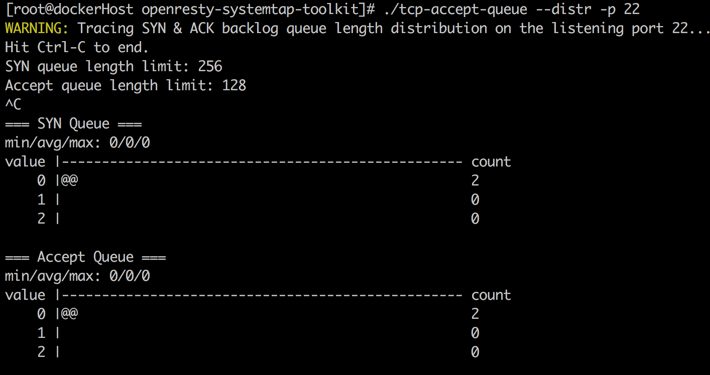

# systemtap-practice
systemtap practice

## INSTALL
* CentOS 7
  ```
  curl https://raw.githubusercontent.com/WALL-E/static/master/setup/redhat/install_systemtap|bash
```
* CentOS 6.8
  ```
  yum install kernel-devel-`uname -r`  # From ISO

  yum install -y http://debuginfo.centos.org/6/`uname -m`/kernel-debuginfo-common-`uname -m`-`uname -r`.rpm
  yum install -y http://debuginfo.centos.org/6/`uname -m`/kernel-debuginfo-`uname -r`.rpm

  yum install -y systemtap

  # 测试stap
  stap -V >/dev/null && echo "stap is ok"

  # 测试kernel-debuginfo
  stap -L 'kernel.function("printk")' > /dev/null && echo "kernel-debuginfo is ok"
```

## TEST
```
# test stap
stap -V

# test kernel-debuginfo
stap -L 'kernel.function("printk")'

# test glibc-debuginfo
stap -L 'process("/lib64/libc.so.6").function("malloc")'
```

## Community Resources and Tools

* http://sourceware.org/systemtap/
* https://github.com/brendangregg/systemtap-lwtools
* https://github.com/openresty/openresty-systemtap-toolkit

  

* https://github.com/youzan/systemtap-toolkit


## Example

* basic
  * execsnoop-nd.stp
    * Trace process exec()s with arguments
    * [link](https://github.com/brendangregg/systemtap-lwtools/blob/master/execsnoop-nd.stp) 

* net
  * accept2close-nd.stp
    * Show socket duration: accept()->close()
    * [link](https://github.com/brendangregg/systemtap-lwtools/blob/master/net/accept2close-nd.stp) 
    
* proc
  * syscallbypid-nd.stp
    * Count syscalls with process details
    * [link](https://github.com/brendangregg/systemtap-lwtools/blob/master/proc/syscallbypid-nd.stp) 
